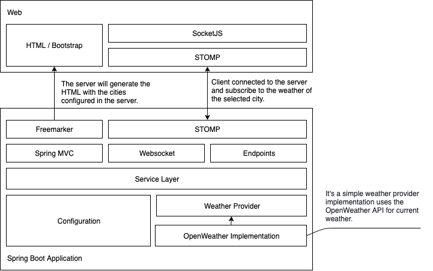

#### About

It a simple application demonstrating how to render an HTML page in the server-side,
and how to use the Spring WebSocket to send the messages to a specific user 
without Spring Security.

#### How to run it?

```bash
chmod +x mvnw
./mvnw clean spring-boot:run
```

If you see the following similar messages printed out, then open web browser and navigate to http://127.0.0.1:8080, 
you will see the web page which contains a dropdown and a table.

```
Started WeatherApplication in 2.553 seconds (JVM running for 2.959)
```

#### Technology Explain

The following picture shows what components this web application contains.



##### Front end

The front end using Bootstrap to draw the pages, and using the SockJS and STOMP for higher layer bidirectional communication.
For details, please check [action.js](src/main/resources/static/js/actions.js).

##### Back end

The back end is a Spring Boot Application, it using the FreeMarker to generate the HTML pages, 
and using Spring Websocket for server push.

It does not using any database, if you want to add more cities or tune the default CityWeatherProvider, 
can modify the [application.yaml](src/main/resources/application.yaml) to achieve it.